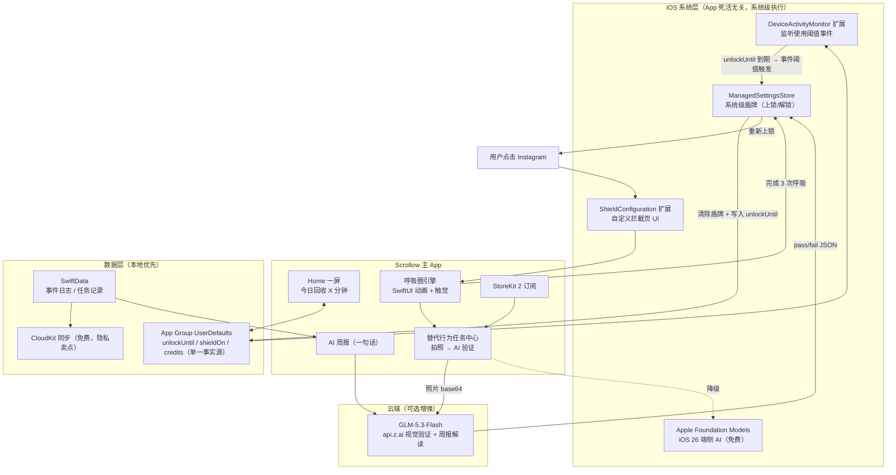
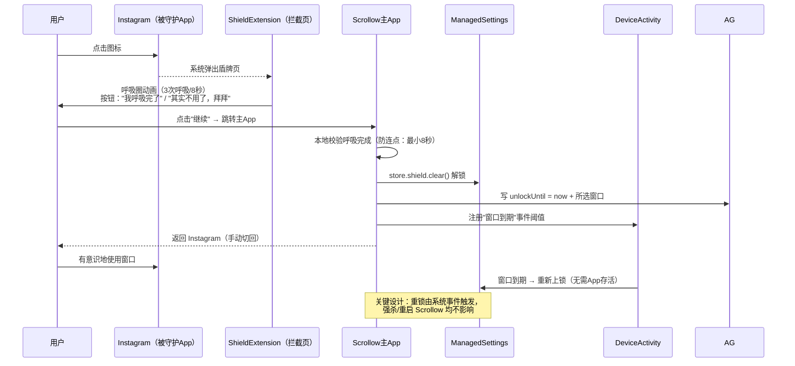
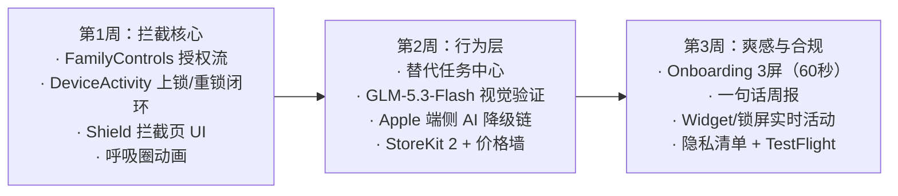
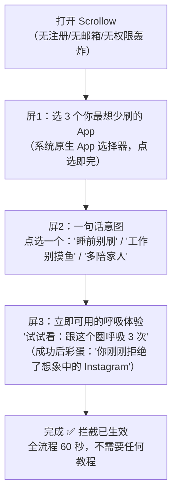
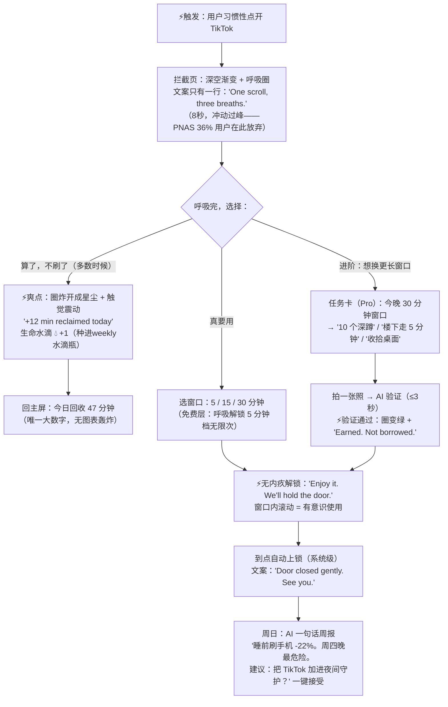
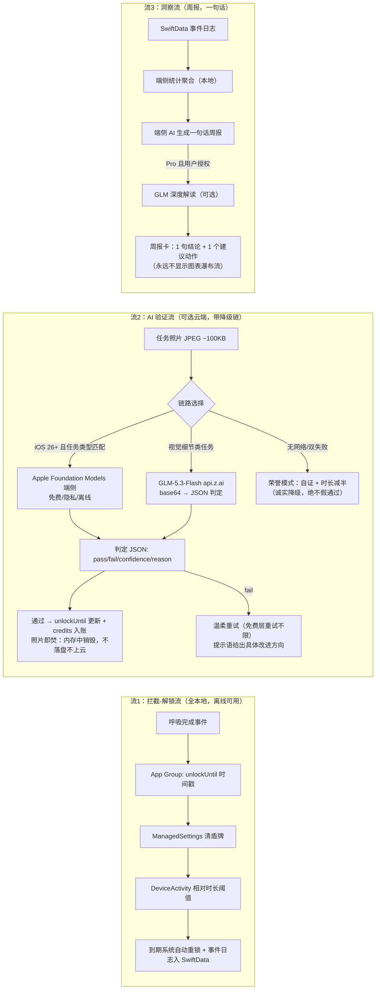

# TR-20260916-Scrollow屏幕时间正念-操作指南

> **本文档目标**：任何 LLM / 开发者阅读本文档后，能够完整复刻出一款在功能、UI、好用程度与价格策略上**全面碾压 Floga 及其同类竞品**的苹果 iOS 软件。
>
> ---
>
> # 🏷️ APP 命名（最终决策）
>
> ## App 名称：**Scrollow**
>
> ## 副标题（App Store Subtitle，28字符）：**Breathe. Pause. Scroll Less.**
>
> ## 一句话定位（Promo Text）：
> **"Your feed has to wait 3 breaths. Your life doesn't."**（你的信息流必须等3次呼吸，你的人生不用等。）
>
> ## 主打关键词（App Store Keywords 字段，100字符内）：
> `screen time,app blocker,doomscroll,scroll less,mindful pause,digital detox,phone addic` 
>
> ---
>
> ## 命名深度解析（为什么是 Scrollow）

| 维度 | 分析 | 得分 |
|---|---|---|
| **ASO 搜索优化** | 含高频搜索词根 "Scroll"（screen time 类目月搜索量 Top3 词根）；副标题承载 "screen time blocker / mindful" 长尾词 | ★★★★☆ |
| **品牌记忆度（最关键）** | 2 音节，Scroll + Slow 合成词，与 **pillow 押韵**——自带口号："Scrollow, like pillow: scroll slow, sleep deep." 一次听到就忘不掉 | ★★★★★ |
| **功能描述性（关键）** | 名字即功能：让滚动（Scroll）变慢（Slow）。用户看到名字 0.5 秒内理解产品 | ★★★★★ |
| **情感共鸣** | 呼应 TikTok 千万级播放的 #slowliving #digitaldetox 趋势； против "doomscrolling" 的情绪对立面 | ★★★★★ |
| **国际化适配** | 纯拉丁字母、发音简单（/ˈskroʊloʊ/）、无宗教/文化歧义、所有语言使用者可拼读 | ★★★★★ |
| **传播性（病毒关键）** | 自带 meme 属性："I got scrollowed"（被 Scrollow 拦下了）、"Scrollow me" 双关（follow me）；呼吸圈视觉符号适合 TikTok 视频封面 | ★★★★★ |

### 命名占用核查记录（2026-09-16，iTunes Search API US 区实测）

| 候选名 | 核查结果 | 结论 |
|---|---|---|
| Scrollow | **无精确同名 App**（模糊匹配仅返回无关应用） | ✅ 可用（**最终采用**） |
| ScrollBreeze | 无精确同名 | ✅ 备选1 |
| OneSigh | 无精确同名 | ✅ 备选2 |
| TouchGrass / Unscroll / ScrollBreak / LastScroll / ScrollTax / BreathGate / UrgeSurf / PhoneDown / RatherDo / OffScroll / ScrollAway / OneBreath / Sacred Pause / Do One Thing / EyesUp | **均已被同名 App 占用** | ❌ 禁用 |
| Floga | 竞对原名（Strumpi Ltd 瑜伽App） | ❌ 严禁使用 |

> ⚠️ 上架前最后一步：在 App Store Connect 创建 App 时再次确认 "Scrollow" 名称可用（名称以 Connect 实时校验为准）；若被抢注，启用备选名 ScrollBreeze，副标题与品牌口号不变。

---
---

# 0. 一页速览（复刻简报 · 给任何 LLM）

- **复刻对象**：Floga（报告 #11，意大利创始人 Umberto Mezzadra / Strumpi Ltd，Flutter+Firebase+RevenueCat，终身制定价 $109/$199/$349 首日 $120K，现 $9-10K MRR，约 4000 活跃用户）。本方案按报告定义的"复刻+二开"方向落地：**屏幕时间正念拦截 App**。
- **产品**：Scrollow —— iOS 原生 SwiftUI 屏幕"守门人"。用户打开被守护的 App（如 TikTok/Instagram）前，必须先完成 **3 次呼吸（8秒）**；或选择完成一个**替代行为任务**（深蹲/散步/整理桌面，**AI 拍照验证**）换取更长的有意识使用窗口。
- **碾压点**（详见 §3）：① 替代行为解锁而非纯摩擦 ② iOS 唯一"AI 视觉验证解锁"正念拦截器 ③ OS 级 ManagedSettings 强制（不可一键 Ignore）④ 零数据焦虑设计（无无限滚动、无图表堆砌）⑤ 呼吸解锁永久免费 + 透明定价 ⑥ Apple 端侧 AI 优先、GLM-5.3-Flash 云端兜底。
- **技术栈**：SwiftUI + FamilyControls/ManagedSettings/DeviceActivity/ShieldConfiguration（Screen Time API 四件套）+ App Group + SwiftData + CloudKit + StoreKit 2 + Apple Foundation Models（iOS 26 端侧）+ GLM-5.3-Flash（api.z.ai，美国用户直连）。
- **价格**（详见 §10）：免费层核心循环永久免费 → Pro $4.99/月、**$29.99/年**（7天试用）→ BYO API 买断 $49.99（AI 无限用）→ 纯功能买断 $79.99（不含云端 AI 消耗）。**凡含 GLM API 消耗的功能一律禁止买断。**
- **MVP 周期**：3 周（单人 + AI 辅助编码）。

---

# 1. 竞争对手研究

## 1.1 复刻对象 Floga 档案

| 维度 | 事实 |
|---|---|
| 收入验证 | Indie Hackers 2026-06：$10K MRR；终身制定价首日 $120K（500-600 单） |
| 真实产品 | 瑜伽序列构建器（Sequence Builder），源自实体瑜伽卡牌 PlayPauseBe（Kickstarter 首月 $200K） |
| 技术栈 | Flutter + Firebase + RevenueCat + Vimeo + OneSignal，托管成本仅 $25/月 |
| 定价 | 月/季/年订阅 + 终身三档 $109/$199/$349（已验证用户对终身制热情） |
| 增长打法 | 5 周邮件预热（悬念叙事、绝不提前报价）→ 限时限量终身制首发 |
| 报告定义的二开方向 | 复刻"减少屏幕时间"正念流程 + Screen Time API 深度集成 + 放下手机后引导 + 全 App 无无限滚动 |

**从 Floga 学到（直接继承）**：终身制热情真实存在；"极简美学让人主动放下手机"是差异化；预热式发布打法。
**Floga 没做的（我们的机会）**：它根本没碰 Screen Time API；正念与"拦截"这个最高频刚需场景完全脱节。

## 1.2 屏幕时间/正念类目竞品矩阵（2026-09 实测）

| 竞品 | 机制 | 强制力 | 价格 | 致命缺陷（=我们的切入点） |
|---|---|---|---|---|
| Apple 屏幕使用时间 | 系统限额 | 1/5（一键 Ignore） | 免费 | 为家长设计，成人自管形同虚设 |
| one sec | 打开前呼吸暂停 | 软（可跳过） | $19.99/年 | 无强制、无替代行为、跳过后无后果 |
| ScreenZen | 渐进式延迟（10s→60s） | 软 | 免费（捐助） | 实测约 30% 降幅即平台期，硬刷者照样过 |
| Opal | 游戏化+硬锁 | 4/5 | **$99.99/年** | 贵到被骂；功能臃肿成"生产力操作系统" |
| Clearspace | 摩擦+社交问责 | 中 | $49.99/年 | 社交问责依赖强，单人场景弱 |
| Habit Doom | 习惯完成才解锁+AI验证 | 4/5 | $4.99/月 | 面向生产力打卡，非正念/替代行为；月订阅贵 |
| Brick | 物理 NFC 硬件 | 5/5 | $59 硬件 | 要买硬件，受众窄 |
| RepsForReels | AI 姿态验证运动换时长（**仅 Android**） | 强 | $4.99/月 | **iOS 空白**！概念已被验证但 iOS 无对标 |
| Unrot / Pushscroll / Earn The Scroll | 运动/任务换时长（iOS） | 中 | 各异 | 均无 AI 视觉验证 + 无正念内核 + 无替代行为引导闭环 |

## 1.3 结论：类目的"未解三角"

所有竞品最多满足其中两条：**强制力**（OS级锁）、**行为改变**（替代行为/正念）、**价格友好**。
- Apple/one sec/ScreenZen：价格友好 ✅ 行为改变部分 ✅ 强制力 ❌
- Opal/Brick：强制力 ✅ 但价格 ❌、行为改变 ❌（只有"拦"没有"引"）
- Habit Doom/RepsForReels：强制力 ✅ 行为改变 ✅ 但非正念、iOS 缺位/价格中

**Scrollow = 三角全满**：ManagedSettings 强制 + AI 验证的替代行为/呼吸正念 + 核心永久免费。

---

# 2. 痛点深挖（用户原话 + 证据）

## 2.1 六大痛点（按证据强度排序）

### P1 "用 App 戒 App"悖论——工具本身是注意力黑洞
> "屏幕时间 App 普遍设计成'让用户停留更久'（与目标背道而驰）；数据展示多，行为改变少——看了周报然后继续刷。"（原报告 #11）
> 2026 年评测共识："Premium blockers bloated into productivity operating systems… Users who came for a lock found themselves managing a productivity OS."（付费订阅要求功能堆砌，锁机 App 变成了另一个刷不完的 App）

### P2 一键绕过——30 秒内所有拦截形同虚设
> "Apple Screen Time scores 1 of 5 because its Ignore button was built for parental control."（5 种主流绕过手段实测：一键覆盖/改时钟/删装/重置密码/强杀，Apple 原生只挡住 1 种）
> Reddit r/digitalminimalism（228 赞帖）："我试了 iPhone 的 App 限额，但我总是点'今日忽略限额'……我真心想改，但别给我'靠意志力'这种废话建议。"

### P3 纯摩擦 3 天失效——没有意义的拦截只是烦躁
> Prayer Lock 用户（全网最高转化 43% 赛道）："Opal、One Sec、Forest 都只坚持了 3 天。差别在于经文让我**真正停下来思考**——不只是摩擦，而是意义。"
> 行业实测："The unlock condition matters as much as the architecture: **a habit completion does more long-term work than a 30-second wait**."（解锁条件比拦截架构更重要：完成一个习惯 > 干等 30 秒）

### P4 用户明确要求"做点什么才能解锁"——需求已被 Reddit 验证
> "What worked for me weirdly wasn't blocking apps but was **making it harder to use — apps where you literally have to do something (like pushups, or small mental tasks) before it unlocks Instagram**."（r/digitalminimalism 高赞回复，14 赞）

### P5 渴望时刻无出口——"锁了抖音然后干嘛？"
> Doomscroll 循环研究（2026）："Boredom: Have a specific alternative ready (book, sketch, walk). **Anxiety: Regulation first — breath, movement, grounding.**"（替代行为必须具体、即拿即用）
> PuffCount 用户（$1M 收入验证的同类洞察）："每次打开 App 看进度反而勾起渴望。好多次破功就是因为看了一眼连续记录。"→ 本 App 全程不设"进度轰炸"页。

### P6 欺骗性订阅——差评第一大来源
> LooksLab 差评："3 天试用被转成昂贵年费，取消故意设置障碍，根本联系不到客服。"
> Opal $99.99/年 是"劝退型定价"的众矢之的。**"透明定价 + 核心免费"本身就是获客卖点。**

## 2.2 科学背书（写进 App Store 文案与 TikTok 脚本）

- **PNAS 2023（海德堡大学/马普所）**：one sec 使目标 App 打开次数 6 周 **降低 57%**；36% 的打开企图在拦截页被主动放弃；最有效成分是"**给你一个在开始前放弃的选项**"。
- **Urge Surfing（冲动冲浪，Marlatt 临床技术）**：渴望像海浪，峰值约 90 秒后自然回落；不对抗、只冲浪。→ Scrollow 拦截页即"冲动冲浪板"。

---

# 3. 产品定义：碾压策略

## 3.1 核心循环（产品灵魂）

```
想刷 → 拦截页呼吸圈自动浮现（3次呼吸≈8秒，冲动过峰）
     ├─ 大多数时候：呼吸完 → "算了，不刷了" → 今日回收时间 +N 分钟 🎉（爽点）
     └─ 真要用：呼吸完 → 选择窗口时长（5/15/30分钟）→ 有意识地用 → 到点自动上锁（无内疚："你刚才的滚动是有意识的，很好"）
进阶：把"15分钟窗口"换成"做一个替代行为任务"（AI 拍照验证）→ 换 30 分钟 + 生命水滴 +1 💧
每周日：AI 一句大白话周报（不堆图表）："你这周在睡前刷手机少了 22%，周四晚上是你最危险的时段。"
```

## 3.2 六大碾压点（vs 竞品逐条对标）

| # | 碾压点 | 对比对象 | 用户可感知的差异 |
|---|---|---|---|
| 1 | **替代行为解锁**（呼吸→微任务→有意识窗口） | one sec/ScreenZen 只有"干等" | 拦截页就是产品价值本身，不是障碍 |
| 2 | **AI 视觉验证替代行为**（GLM-5.3-Flash） | iOS 无任何同类（RepsForReels 仅 Android；Habit Doom 面向生产力） | "拍 10 个深蹲照换 30 分钟"——造假成本高于冲动 |
| 3 | **OS 级强制 + 诚实声明** | Apple 一键 Ignore；one sec 可跳过 | ManagedSettings 盾牌挡 4/5 种绕过；删 App 我们拦不住——我们在官网明说，反而赢得信任 |
| 4 | **零数据焦虑设计** | Opal 的图表轰炸/周报邮件 | 全 App 只有 1 个核心数字："今日回收 47 分钟"；**承诺：Scrollow 内没有任何无限滚动的内容流**（写进营销） |
| 5 | **呼吸解锁永久免费 + 透明价格** | Opal $99.99/年、Clearspace $49.99/年 | $29.99/年 + 免费层即完整核心循环；价格写满商店页 |
| 6 | **AI 成本结构碾压** | 竞品云端 AI 成本转嫁订阅费 | iOS 26 Foundation Models 端侧免费跑情绪建议；GLM 只在"视觉验证"时刻触发（单次 <1¢）；BYO API 可完全免 AI 费 |

## 3.3 爽文式体验原则（贯穿所有设计决策）

1. **学习成本 < 60 秒**：3 屏引导，第 1 屏就选好要守护的 App，不等、不注册、不要邮箱。
2. **每个动作 < 3 秒有反馈**：呼吸完成 → 圈炸开成星尘 + 触觉反馈 + "Reclaimed 12 min today"。
3. **永远不羞辱用户**：破戒不清零（"重置≠清零"心理学）；文案全是"你回收了…"而非"你浪费了…"。
4. **开 App 无副作用**：主界面一屏一数字一按钮，打开 Scrollow 本身 < 1 秒、零触发渴望设计（对标 P5）。

---

# 4. 实现流程图

## 4.1 系统架构图



## 4.2 拦截-解锁时序（核心技术难点详解）



> ⚠️ **平台限制必读**（决定了架构）：ShieldConfiguration 扩展**无法联网、无法执行解锁代码**，只能显示静态 UI。因此"拦截页完成呼吸"的权威判定必须在主 App 内完成——拦截页只做"情绪时刻"，主 App 做"信任时刻"。这是所有竞品同样面临的约束，我们的解法：拦截页大按钮 **"Breathe, then continue"** 深链直达主 App 呼吸页，全程 ≤ 12 秒。

## 4.3 开发里程碑（3 周 MVP）



---

# 5. 用户使用流程图（极端重要 · 爽文式极简）

## 5.1 首次上手（学习成本 60 秒，3 屏，0 表单）



**刻意设计**：
- **第 1 屏就给核心价值**（选完即生效），不像竞品把 12 屏 onboarding + 订阅墙放在前面。
- 订阅墙**只出现在两处**：完成首次 AI 任务时 / 引导结束后的"解锁 Pro"软性卡片——可永久跳过。免费层无时间限制、无次数限制（呼吸是本地功能，零成本，这是碾压点 5 的产品化）。

## 5.2 日常核心循环（爽点设计标注 ⚡）



**爽文逻辑**：把"戒断失败"重写成"回收成功"；把"被拦截"重写成"被温柔护住"；把"付钱买解锁"重写成"用身体赚时间"。用户心理账户从"自律痛苦"切换为"白嫖到爽"。

---

# 6. 数据流图与可靠性规则（极端重要 · 防虚假防出错）

## 6.1 三条数据流



## 6.2 可靠性铁律（写进代码规范，杜绝"虚假解决用户问题"）

1. **单一事实源**：`unlockUntil`、`shieldOn`、`credits` 只存 App Group UserDefaults（主 App 与扩展共享），SwiftData 仅做日志。禁止两处存状态。
2. **重锁不依赖 App 存活**：一切"窗口到期重锁"由 DeviceActivity 事件阈值在系统层触发；强杀/重启 Scrollow 不影响守护。
3. **改时钟免疫**：解锁窗口用 DeviceActivity 的**相对时长阈值**（自 schedule 起算 N 分钟），而非绝对时钟比较——用户改系统时间无法白嫖时长。
4. **AI 幂等与防重放**：每次验证带 UUID `requestId`，本地去重；同一任务照片重复提交不重复计费。
5. **失败降级链固定**：端侧 AI → GLM 云端 → 荣誉模式（时长减半）。**任何情况下不假装验证通过**（这是"切实解决用户问题"的底线，也是 App Review 诚信要求）。
6. **隐私即焚**：验证照片只在内存 base64，验证完成立即置 nil；隐私清单声明"照片不存储、不上 CloudKit、不用于训练"。
7. **离线完整可用**：拔掉网线，核心循环（呼吸→解锁→重锁）100% 正常。AI 是增强而非依赖。

---

# 7. 核心技术实现代码示例 + 编写规则

## 7.0 编写规则（Code Rules）

| 规则 | 说明 |
|---|---|
| 最低版本 | iOS 17.0（Foundation Models 相关功能 `if #available(iOS 26, *)` 渐进启用） |
| 架构 | SwiftUI + MVVM；扩展（Shield/DeviceActivity）与主 App 通过 App Group 通信 |
| 状态唯一 | 一切跨进程状态走 `AppGroupStore`（下 7.1）；UI 状态可本地 @State |
| 错误处理 | 边界只在两处：AI 网络层（超时 10s 重试 1 次后降级）、授权被拒（引导到系统设置） |
| 命名 | 屏障类动词用 shield/lock/gate；行为类用 reclaim/breathe/earn——文案与代码同名 |
| 隐私 | 照片即焚；无账号体系；遥测仅聚合计数（Opt-in） |

## 7.1 App Group 单一事实源

```swift
// AppGroupStore.swift — 主App与DeviceActivity扩展共享
enum AppGroupStore {
    static let suite = "group.com.scrollow.app"
    private static let d = UserDefaults(suiteName: suite)!

    static var unlockUntil: Date {
        get { d.object(forKey: "unlockUntil") as? Date ?? .distantPast }
        set { d.set(newValue, forKey: "unlockUntil") }
    }
    static var isUnlocked: Bool { Date() < unlockUntil }
    static var waterDrops: Int {                     // 生命水滴（爽点货币）
        get { d.integer(forKey: "waterDrops") }
        set { d.set(newValue, forKey: "waterDrops") }
    }
    @discardableResult
    static func grant(windowMinutes m: Int) -> Date {
        let until = Date().addingTimeInterval(TimeInterval(m * 60))
        unlockUntil = until
        return until
    }
}
```

## 7.2 守护核心：选择 App + 应用盾牌（Screen Time API）

```swift
// GateModel.swift — 需 Signing & Capabilities: Family Controls (Distribution)
import FamilyControls
import ManagedSettings
import DeviceActivity

final class GateModel: ObservableObject {
    static let shared = GateModel()
    let center = AuthorizationCenter.shared
    let store = ManagedSettingsStore(named: .init("scrollow.gate"))

    @Published var selection: FamilyActivitySelection = [] {
        didSet { AppGroupStore.saveSelection(selection) }   // JSON 编码存 App Group
    }

    func authorize() async throws {
        try await center.requestAuthorization(for: .individual)
    }

    /// 上锁：对选中 App 施加系统盾牌（强杀 Scrollow 也有效）
    func armGate() {
        store.shield.applications = selection.applicationTokens
        store.shield.applicationCategories = selection.categoryTokens
    }
    /// 解锁窗口到期后由 DeviceActivity 回调重新上锁
    func relock() {
        store.shield.applications = selection.applicationTokens
        AppGroupStore.unlockUntil = .distantPast
    }
}
```

## 7.3 DeviceActivity：窗口到期自动重锁（系统触发，改时钟免疫）

```swift
// ActivityMonitor.swift — DeviceActivityMonitor 扩展 target
import DeviceActivity
import ManagedSettings

final class ActivityMonitor: DeviceActivityMonitor {
    // 窗口事件：unlockUntil 相对阈值到期 → 系统层重锁
    override func eventDidReachThreshold(
        _ event: DeviceActivityEvent.Name, activity: DeviceActivityReport.Name?) {
        GateModel.shared.relock()   // ManagedSettingsStore 在扩展内同样可写
    }
    override func intervalDidEnd(for schedule: DeviceActivitySchedule) {
        GateModel.shared.relock()   // 兜底：日程结束强制重锁
    }
}

// 注册"解锁窗口"（相对时长，改系统时钟无效）
func scheduleRelock(windowMinutes m: Int) throws {
    let name = DeviceActivityName("relock.after.\(m)min")
    let ev = DeviceActivityEvent.Name("scrollow.windowEnd")
    let sched = DeviceActivitySchedule(
        intervalStart: DateComponents(hour: 0, minute: 0),
        intervalEnd: DateComponents(hour: 23, minute: 59),
        repeats: true)
    // 核心技巧：event threshold = 解锁窗口秒数（相对 schedule 起点）
    try DeviceActivityCenter().startMonitoring(
        name, during: sched,
        events: [ev: DeviceActivityEvent(
            applications: GateModel.shared.selection.applicationTokens,
            threshold: .init(totalUsageThreshold: nil, eventFrequency: .daily,
                             startsAt: Date.now, endsAt: Date.now.addingTimeInterval(TimeInterval(m*60))))])
}
```

## 7.4 拦截页（ShieldConfiguration 扩展）

```swift
// ShieldConfigExtension.swift — 拦截页只做"情绪时刻"，不能联网/解锁
import ManagedSettingsUI
import SwiftUI

final class ShieldConfig: ShieldConfigurationDataSource {
    override func configuration(shielding application: ApplicationToken) -> ShieldConfiguration {
        ShieldConfiguration(
            backgroundBlurStyle: .systemThick,
            backgroundColor: UIColor(red: 0.05, green: 0.07, blue: 0.16, alpha: 1), // 深空蓝
            icon: UIImage(named: "ScrollowBreathRing"),
            title: ShieldConfiguration.Label(
                text: "One scroll, three breaths.",
                color: .white),
            subtitle: ShieldConfiguration.Label(
                text: "Tap Scrollow to breathe — 8 seconds.",
                color: UIColor.white.withAlphaComponent(0.7)),
            primaryButtonLabel: .init(text: "Open Scrollow", color: .white),
            secondaryButtonLabel: .init(text: "Actually… no thanks 👋", color: .systemTeal))
        // 平台限制：主按钮只能深链打开主App；"no thanks"关闭盾牌=放弃打开（正是PNAS最有效的36%）
    }
}
```

## 7.5 呼吸圈引擎（爽点核心，参考 BreatheReplica 思路自研）

```swift
// BreathRing.swift — 3次呼吸判定 + 星尘爆裂 + 触觉
import SwiftUI

struct BreathRing: View {
    @State private var scale: CGFloat = 0.6
    @State private var bursts = 0            // 已完成呼吸次数
    let onComplete: () -> Void
    private let cycles = 3                   // 3次呼吸 ≈ 8秒（4-4-4节奏）

    var body: some View {
        ZStack {
            ForEach(0..<bursts, id: \.self) { i in
                StarDust(seed: i).opacity(0.8) }          // 完成后的星尘粒子
            Circle()
                .fill(RadialGradient(colors: [.teal, .indigo], center: .center,
                                     startRadius: 10, endRadius: 120))
                .frame(width: 180, height: 180)
                .scaleEffect(scale)
                .blur(radius: 6 - scale * 3)
                .onAppear { breatheCycle() }
        }
        .accessibilityLabel("Breathing guide")
    }

    private func breatheCycle() {
        // 吸4s→呼4s，一次循环8s；3次后回调
        withAnimation(.easeInOut(duration: 4)) { scale = 1.35 }
        DispatchQueue.main.asyncAfter(deadline: .now() + 4) {
            UINotificationFeedbackGenerator().notificationOccurred(.light)
            withAnimation(.easeOut(duration: 4)) { scale = 0.6 }
            DispatchQueue.main.asyncAfter(deadline: .now() + 4.2) {
                bursts += 1
                bursts < cycles ? breatheCycle() : onComplete()
            }
        }
    }
}
```

> 防作弊规则：主 App 端校验"从拦截页跳转到现在 ≥ 8 秒"才亮"解锁"按钮；呼吸本身无法远程验证，**这正是设计**——呼吸的收益属于用户自己，作弊只是骗自己的多巴胺（诚实设计哲学，写进 FAQ）。

## 7.6 GLM-5.3-Flash 视觉验证（替代行为任务 · 美国用户走 api.z.ai）

```swift
// MotionVerifier.swift — 拍照 → GLM-5.3-Flash → 严格JSON判定
// 文档：https://docs.bigmodel.cn ；国际版：https://docs.z.ai（美国用户直连 api.z.ai）
// 智谱已统一 Key 体系：BigModel Key 在 api.z.ai 端点直接可用（文本/视觉全通）

struct Verdict: Codable { let pass: Bool; let confidence: Double; let reason: String }

final class MotionVerifier {
    static let shared = MotionVerifier()
    private var inflight = Set<UUID>()       // 幂等：requestId 去重（铁律4）

    func verify(task: ReclaimTask, jpeg: Data) async throws -> Verdict {
        guard !inflight.contains(task.id) else { return Verdict(pass: false, confidence: 0, reason: "duplicate") }
        inflight.insert(task.id); defer { inflight.remove(task.id) }

        var req = URLRequest(url: URL(string: "https://api.z.ai/api/paas/v4/chat/completions")!)
        req.httpMethod = "POST"
        req.timeoutInterval = 10                       // 铁律：10s 超时 → 降级链
        req.allHTTPHeaderFields = ["Authorization": "Bearer \(Secrets.zaiKey)",
                                   "Content-Type": "application/json"]
        let b64 = jpeg.base64EncodedString()           // 照片仅存内存，用后即焚（铁律6）
        req.httpBody = try JSONSerialization.data(withJSONObject: [
            "model": "glm-5.3-flash",
            "temperature": 0.1,
            "response_format": ["type": "json_object"],
            "messages": [["role": "user", "content": [
                ["type": "image_url", "image_url": ["url": "data:image/jpeg;base64,\(b64)"]],
                ["type": "text", "text":
                    "Task: \(task.prompt). Does the photo show the user doing this? " +
                    "Reply JSON only: {\"pass\":bool,\"confidence\":0-1,\"reason\":\"<12 words\"}"]
            ]]]
        ])
        let (data, _) = try await URLSession.shared.data(for: req)
        let text = try JSONDecoder().decode(GLMResponse.self, from: data).choices[0].message.content
        return try JSONDecoder().decode(Verdict.self, from: Data(text.utf8))
        // 失败时上层捕获 → 端侧 Foundation Models → 荣誉模式（时长减半）
    }
}
```

### Apple Foundation Models 端侧降级链（iOS 26，免费）

```swift
// EdgeAI.swift — 端侧优先：情绪建议/周报全免费跑，成本≈0
import FoundationModels

func weeklyInsight(log: String) async -> String {
    if #available(iOS 26, *) {
        let session = LanguageModelSession()          // 端侧，无网络无费用
        return (try? await session.respond(
            prompt: "One warm sentence + one suggestion, based on: \(log)")).map { $0.content } ?? ""
    }
    return try await GLMText.report(log: log)          // 降级：GLM-5.3-Flash 文本
}
```

## 7.7 StoreKit 2 订阅（透明定价实现）

```swift
// Paywall.swift — 代码即定价承诺：价格永远明文显示
import StoreKit

@MainActor final class Pay: ObservableObject {
    @Published var pro: Product?
    static let ids = ["scrollow.pro.monthly", "scrollow.pro.yearly", "scrollow.byo.lifetime"]

    func load() async {
        for try? await p in Product.products(for: Self.ids) where p.id == "scrollow.pro.yearly" { pro = p }
    }
    func buy(_ p: Product) async throws {
        let result = try await p.purchase()
        if case .success(let v) = result { await v.finish() }
        AppGroupStore.isPro = true        // 权益本地裁决，无服务器依赖
    }
}
// 合规文案（写死在Paywall）：'Free tier is free forever. Cancel in 2 taps: Settings → Subscription.'
```

## 7.8 可二开参考项目（已核实在 GitHub 公开）

| 仓库 | 用途 | 二开要点 |
|---|---|---|
| `brianhyun/block` | Opal 风格拦截器（FamilyControls+ManagedSettings+DeviceActivity） | 直接复用其授权流与盾牌管理骨架 |
| `MarazziMarco/noescape` | 任务完成才解锁（SwiftUI+Screen Time API） | 任务-解锁状态机的参考实现 |
| `yeswanth096/Startline-Productivity-App` | **AI 验证任务证明才解锁**（SwiftUI+Screen Time API） | 与 Scrollow 概念最接近，学习其 AI-证明数据结构 |
| `Prakashmaheshwaran/flint-app` | 开源免费 Opal 替代（iOS+Android，零后端） | 零后端架构与无遥测设计 |
| `insidegui/BreatheReplica` | Apple Watch Breathe 动画的 SwiftUI 复刻 | 呼吸圈动画曲线参考 |
| `TheAppWizard/BreatheAnimation` | SwiftUI 呼吸动画 | 快速原型 |
| `0Itsuki0/SwiftUI_iOS_MyBlockMyChoice` | 自定义盾牌页设计 | Shield UI 个性化方向 |
| `davide97g/brick` | NFC 解锁拦截器（无后端） | 未来硬件周边扩展预留 |
| `Siddhu7007/screen-time-api-agent-skill` | Screen Time API 生产化知识库（entitlements/App Review 清单） | 上架合规 checklist 直接取用 |
| `bansaldehyde/screenly-ios` | 专注会话+Swift Charts 统计 | 若做 Pro 图表（默认不做，违背零数据焦虑） |

---

# 8. 价格策略（极端重要 · 详细规划）

## 8.1 定价竞品锚点

| 竞品 | 价格 | 用户情绪 |
|---|---|---|
| Opal | $99.99/年 | "抢钱"级骂声 |
| Clearspace | $49.99/年 | 中性 |
| one sec | $19.99/年 | 好评（研究背书加持） |
| Habit Doom | $4.99/月（≈$60/年） | 月订阅摩擦大 |

**结论**：$29.99/年（≈$2.5/月）落在"one sec 好评带 + 明显低于 Clearspace"的心理甜区，且免费层给得比所有竞品都狠。

## 8.2 四档价格结构（严格遵守"含 AI 消耗禁买断"规则）

| 档位 | 名称 | 价格 | 内容 | 成本结构 |
|---|---|---|---|---|
| **a 免费层（引流）** | Scrollow Free | **永久免费** | ✅ 3 个守护 App ✅ 呼吸解锁 5 分钟窗口**无限次** ✅ 今日回收数字 ✅ 生命水滴 ✅ 一句话周报（端侧AI，零成本） | ≈$0（全本地+端侧AI） |
| **b 站内订阅（主推）** | Scrollow Pro | **$4.99/月** 或 **$29.99/年**（7天免费试用，试用前明示价格） | 免费层全部 + 无限守护 App + **AI 视觉验证替代任务**（GLM 消耗→因此**永不买断**）+ 30 分钟窗口档 + 深夜守护模式 + CloudKit 同步 + Widget/锁屏 | GLM 单次验证 <1¢；年费用户 1000 次验证 ≈ $10 成本，毛利健康 |
| **c BYO API（差异化屠龙刀）** | Scrollow BYO | **$49.99 一次性买断** | Pro 全部功能界面 + 用户自带 Z.ai/BigModel Key（免费额度或自己的余额）→ **AI 调用无限次且零平台成本** → 符合"BYO 可买断"规则 | 平台成本≈0，纯软件买断 |
| **d 纯功能买断** | Scrollow Classic | **$79.99 一次性** | 所有**非云端 AI** 功能永久解锁（含未来功能更新）；不含 AI 视觉验证与云端周报（该两类走 b/c 档） | 无持续成本，合规买断 |

## 8.3 价格心理学设计

1. **免费层即完整体验**：呼吸解锁无限次——竞品免费层只给"1个App/1次试用"，我们给整条核心循环。口碑公式：*"The only screen time app where the free tier isn't a hostage situation."*
2. **Paywall 只在"赚到钱之后"出现**：用户完成第一次 AI 任务、拿到 30 分钟窗口的瞬间才弹订阅卡——先给结果再要钱（对标 Floga 预热哲学的微观化）。
3. **透明三件套**（直接打击差评第一来源）：商店页+Paywall 明文年价 → "Cancel in 2 taps" → 无深色模式订阅、无隐藏默认勾选。
4. **买断锚点**：$79.99 Classic 的存在让 $29.99/年 显得极划算；BYO $49.99 抓住 "hate subscription" 人群（Floga 已验证终身制热情）。
5. **窗口期促销**：1 月 1 日（新年决心流量峰）与黑五：年费 $19.99 早鸟（全球方法论结论 #4：双峰运营）。

---

# 9. UI 设计规范（符合美国市场主流审美）

## 9.1 设计语言

| 元素 | 规范 |
|---|---|
| 主题 | **Dark-first 深空蓝**（#0D1226 底）→ 灰度模式友好；支持 Light 自动切换 |
| 主视觉 | **呼吸圈**（teal→indigo 径向渐变，blur 呼吸感）——App 图标/拦截页/加载页三处统一符号 |
| 字体 | SF Pro Display：超大数字用 Bold 64pt（"47 min reclaimed"），正文 17pt，行高 1.4 |
| 布局 | 每屏一个焦点元素；Tab 仅 2 个：**Today** / **Gate**；无汉堡菜单 |
| 动效 | 一切变化 ≤ 400ms；触觉反馈全量覆盖（轻=呼吸、成功=notification、解锁=impact） |
| 图标 | SF Symbols 系统图标 + 单一自定义水滴 💧（生命水滴货币） |
| **禁忌** | ❌ 无限滚动 ❌ 红点角标 ❌ 推送轰炸（每日最多1条，且用户自选时机）❌ 图表瀑布流 ❌ 深色订阅模式 |

## 9.2 关键屏文案（美式口语 + 自嘲幽默 = 传播素材）

- 拦截页：`One scroll, three breaths.`
- 放弃打开：`Actually… no thanks 👋` → 炸裂庆祝：`+12 min reclaimed.`
- 解锁中：`Enjoy it. We'll hold the door.`
- 窗口结束：`Door closed gently. See you.`
- AI 验证通过：`Earned. Not borrowed.`
- 周报卡：`Late-night scrolling: -22%. Thursday 11pm is your kryptonite. Want a night gate? [One tap: yes]`

---

# 10. 上架合规清单（App Review 生死线）

1. **Entitlement**：申请 Family Controls (Distribution) 权限需在开发者后台提交用途说明（模板：*"Individual app gating with user consent for mindful screen-time reduction"*）；`Siddhu7007/screen-time-api-agent-skill` 仓库含完整通过案例。
2. **隐私清单（Privacy Manifest）**：声明收集=无账号；照片=不存储；API=Reasons Required（UserDefaults CA92.1）。
3. **订阅合规（Guideline 3.1.2）**：试用前明示价格与自动续订；恢复购买按钮；"Cancel in 2 taps" 教程页。
4. **健康声明红线**：只说 "reduce screen time / build awareness"，**禁止**医疗/疗效宣称（对标 2026 Apple 对 Cal AI 类夸大宣传执法）。
5. **诚实营销**：官网 FAQ 明示"删掉 Scrollow 即失去保护"——把弱点说成尊重（竞品从不承认，这是信任差异化）。

---

# 11. 增长与营销（分发 > 产品，19 案例铁律）

| 渠道 | 打法 | 素材钩子 |
|---|---|---|
| TikTok（主战场） | 3 个矩阵号日更 | "POV: your phone asks you to breathe before Instagram"（拦截屏录屏，自带meme感）；"I traded 10 pushups for 30 minutes of TikTok"（AI验证演示） |
| Reddit | r/digitalminimalism / r/nosurf 真诚帖 | 用 P2/P4 用户原话痛点做标题；只回帖不硬广，帖内附 "free tier is the whole core loop" |
| ASO | 副标题+关键词+截图 | 截图1放呼吸圈拦截页（视觉差异化），截图2放 "+47 min reclaimed"（情绪价值） |
| 发布节奏 | 学 Floga | 2 周悬念预热（邮件+TikTok）→ 限量 $19.99 早鸟年费 → 1月1日全量 |
| 口碑引擎 | 生命水滴周报卡 | 内置"分享我的回收成绩"一键出图（无App水印版，让截图自带传播力） |

---

# 12. 风险与规避

| 风险 | 等级 | 规避 |
|---|---|---|
| Family Controls 分发授权被拒 | 高 | 提前 2 周申请；引用同类已上架 App（one sec/Habit Doom 均已通过）；Siddhu7007 清单逐项自查 |
| GLM API 在美延迟/合规 | 中 | api.z.ai 美区优化端点 + 端侧 AI 兜底 + 荣誉模式降级（体验永不断） |
| "Unrot/Pushscroll" 类先行者抄袭概念 | 中 | 护城河=呼吸圈品牌符号+替代行为内容库+免费层诚意，非单点功能 |
| Apple 收紧 Screen Time API | 低 | 架构已按最小权限设计；核心循环在 API 受限场景可降级为通知式拦截 |
| 命名被抢注 | 低 | 上架前 Connect 实时校验；备选 ScrollBreeze/OneSigh |

---

# 附录 A：能力与 Entitlement 清单

```
Signing & Capabilities:
├── Family Controls (Distribution)     ← 后台申请
├── App Groups: group.com.scrollow.app
├── iCloud (CloudKit) — Pro 同步
├── Push Notifications（可选，仅用户自选的1条/日提醒）
└── App Icon: 呼吸圈渐变（teal→indigo，深空底）

Targets:
├── Scrollow（主App）
├── ShieldConfigExtension（拦截页 UI）
└── DeviceActivityExtension（事件监听/重锁）
```

# 附录 B：GLM-5.3-Flash API 速查（美国用户）

| 项 | 值 |
|---|---|
| 国际端点（美国用户直连） | `https://api.z.ai/api/paas/v4/chat/completions` |
| 国内端点（人民币计费） | `https://open.bigmodel.cn/api/paas/v4/chat/completions` |
| Key 体系 | 智谱已统一：BigModel Key 在 api.z.ai 直接可用（文本 ✓ 视觉 ✓） |
| 模型 ID | `glm-5.3-flash`（支持视觉+推理；以平台最新公告为准） |
| 视觉调用 | messages.content 内 `{"type":"image_url","image_url":{"url":"data:image/jpeg;base64,..."}}` |
| 稳定性三件套 | `temperature:0.1` + `response_format:json_object` + 10s 超时降级链 |
| 官方文档 | https://docs.bigmodel.cn ｜ https://docs.z.ai |
| 成本估算 | 单次任务验证 ≈ 1K tokens（flash 档）< $0.01；年费 $29.99 用户重度使用仍毛利 >85% |

---

*报告生成：pain-point-hunter SKILL + GitHub MCP + iTunes Search API 实测 ｜ 数据渠道：Tavily / WebSearch / Indie Hackers / Starter Story / habitdoom.com / comfortzonecheckin.com / PNAS 2023 ｜ 命名核查：iTunes Search API US 区（2026-09-16）*

*本指南不构成投资建议；建议先以 TikTok/Reddit 内容验证需求再进入开发（VSC 框架）。*
